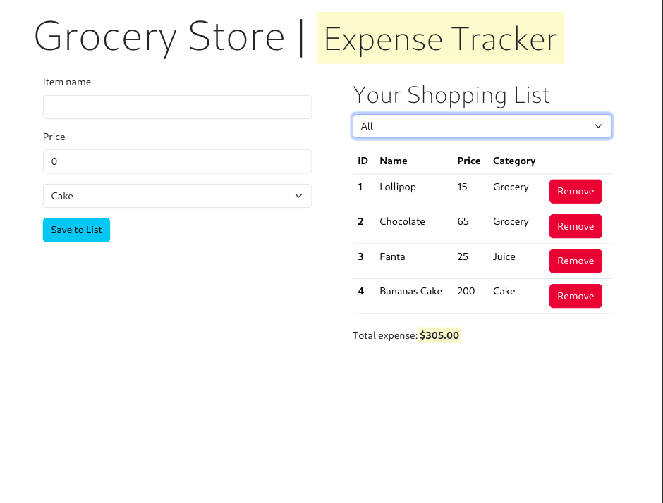
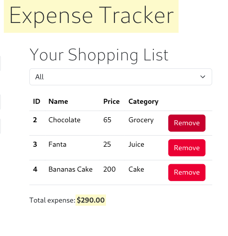
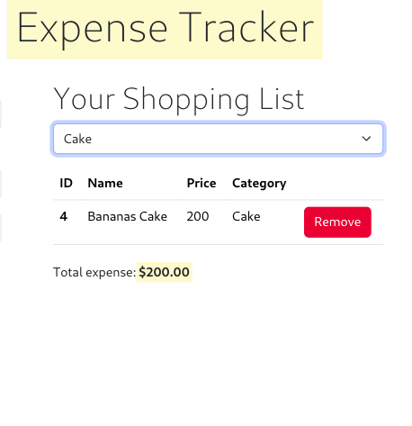
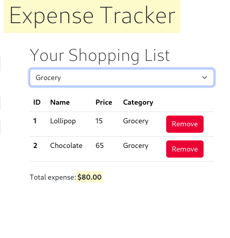

# (Demo) Grocery expense App

Hands on basic React 18 with basic project. Once an item is added to the list or remove, or even filtered the amount is immediately re-assessed.

## Screenshots

Some screenshots of the project.

### Home screen

### Shopping list screen

### Filtering on cake criteria

### Filtering on grocery criteria

## Credit

me :) <mark>Happy Coding</mark>
